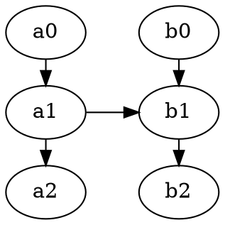

## 语法

### 图的横竖方向


http://blog.csdn.net/sd10086/article/details/52979462


### HTML格式


## 输出格式
包括`gif`, `png`, `pdf`, `jpg`, `svg`, `bmp`

以`gif`为例

```bash
dot -Tgif test.dot -o test.gif
```

[命令行输出格式](https://graphviz.gitlab.io/_pages/doc/info/output.html)
[命令行参数](https://graphviz.gitlab.io/_pages/doc/info/command.html)


## 参考

[官方例子](http://www.graphviz.org/gallery/)
