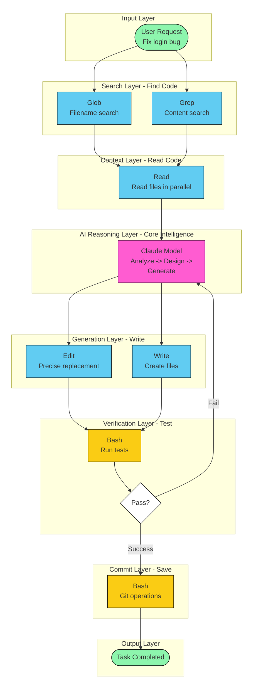

本文实际来自于2025年11月份在北京办公室的一次基于Claude Code的Coding Agent分享「从Jira ticket到MR」内容，聚焦于编码环节的AI和LLM使用方式，其实就是Context Engineering。

时至今日(2026)已经又有很多细节过期了，白驹过隙，尤其是Claude Opus 4.6的发布进一步强化底层模型能力后，2月份甚至都有Harness Engineering的概念了。

<!--more-->

## AI 编码工具使用现状
目前大多数人用的多的还是Cursor，毕竟是可视化的编辑器工具，无论是查看/修改代码还是review都很符合用户的习惯。

### 多数人的使用场景
- 只是在Chat里面问临时随机的问题
    - 问某个库/函数的用法
    - 提问整体架构的建议
- 生成代码
    - 临时的脚本
    - 某个功能的部分代码
    - 调试或者单元测试

### 不够好用
- 生成的代码质量不高
    - 生成的代码没有项目的上下文
    - 完全是错误的解决方案
- 不够聪明
    - 每次都需要描述一遍项目的背景
    - 生成的代码不可控，有时候很多有时候很少
## 开发流程的变化
### Spec驱动的开发
软件开发周期一般是
1. 需求分析
2. 系统设计
3. 开发
4. 测试
5. 部署

更具体的，比如后端开发
1. 读取Jira里面的开发内容
2. 计划这次任务的开发和配置环境
3. 更新接口文件
4. 创建执行数据库DDL
5. 实现增删改查代码
6. 实现业务逻辑
7. 写单元测试
8. 本地运行测试
9. 代码review
10. 提交Merge Request

### 新的开发流程
1. 在 Jira ticket 里编写 prompt 
2. 启动Claude Code，输入 「实现需求 JIRA-xxxx」
3. 在GitLab查看Merge Request

## AI 编码工具的发展

在Claude Code之前，已经有过好多个编码工具了，包括
1. 写prompt到ChatGPT，把生成的代码复制回来
2. 利用GitHub Copilot在编辑器里面看代码补全加快开发速度
3. 在代码的上下文里和AI对话，比如SourceGraph的一个工具，可以省去不少上下文的输入
4. Cursor，在编辑器中可以跨行甚至跨文件自动补全，对于在chat对话中生成的代码提供可视化的review和追踪

## Claude Code

Claude Code和前面的工具最大的区别就是，它不依赖于整个代码库的索引或者RAG来寻找和读懂代码，而是利用最原始的CLI工具，像人一下去查找去读代码，反而比用索引要好得多，因为内部的LLM知道在看完一行代码后下一行去哪里继续找，再综合解析后算是读懂了。

### CLAUDE.md
使用 /init 命令分析新代码库，并将常用的 Bash 命令、核心文件、代码风格指南、测试说明和环境配置等信息写入 CLAUDE.md，Claude Code在每个session启动时都会载入 CLAUDE.md，让 AI 持续记住这些背景知识，避免每次重复输入。

同时我们可以在这里定义整体的运行流程
1. 使用MCP读取Jira的内容
2. 初始化这个需求的开发环境
3. 修改接口文件
4. 修改MQTT协议文件
5. 实现业务逻辑
6. 编写单元测试
7. 提交代码和Merge Request
8. 更新CLAUDE.md文件

### Claude Code Tools
Claude Code 几乎纯粹依赖这些tool来搜索/读取/理解/生成代码，包括Bash, Edit, Glob, Grep, Read, Write, SlashCommand...

除了原生（其实是Linux CLI）命令之外，我们也可以利用slash commands来简化常用命令，比如说push-MR，checkout分支初始化代码环境

更进一步的，Anthropic也提出了MCP的概念，也就是远端/本地的提供Tool的服务，比如让AI agent可以读取wiki或者jira内容，查看/创建Merge Request，创建/执行/查询数据库脚本。

对于没有MCP的场景，我们需要「曲线救国」，在agent和目标软件之间找到一种两者都能懂的格式，比如画图表时优先用Mermaid/PlantUML/Graphviz来表达，利用脚本来生成目标软件的文件，这样远比提供一个流程图图片好懂得多

### Subagents
前面我们都是在做加法，把各种工具和能力加到 Claude Code上面来，但是一个agent session的context是有限的，因为它的底层本质仍然是一个LLM，比如Claude的一般是200K的长度，一味的增加工具只会塞满context窗口或者让agent找不到预期的tool。

所以Anthropic提出了Subagents的概念，既然主agent的context有限，那么就把一些简单的或者说不关心中间流程的任务拆出来在新的context里面完成，也就是让主agent把子任务发给subagent，每个subagent可以定义为某种任务的专家，subagent完成后把结果返回给主agent，每个子代理拥有独立的上下文窗口、专门的工具权限和自定义系统提示词。

比如我们可以构建这些
- 读取jira ticket内容并完成git pull & checkout -b
- 调用公司框架来生成接口文件
- storage层代码生成
- 代码总结和提交gitlab

### Agent Skills
除了分解任务启动一个新的agent context以外，对于上面的提到的CLAUDE.md我们如果把所有想到的信息和东西都塞进去，也是会影响到主agent 的context，而且行数多了以后，其实反而会记不住所有的信息，所以我们需要一种按需加载的信息挂载方式，也就是agent skills。

在skill中，首先描述何时被会触发调用，然后既可以是单纯的知识描述，也可以是某个脚本加上脚本的作用和使用方法。

## 不仅仅是编码
在上述的 AI 参与的开发流程中，我们已经用MCP或者subagent来完成大多数步骤的工作了，其实我们还可以把编码之前和之后的工作也用agent来实现，打通更多的环节。

- **从PM的需求文档中生成工程Spec**
- **从工程文档拆分子任务生成jira**
1. 读取Jira里面的开发内容
2. 计划这次任务的开发和配置环境
3. 更新接口文件
4. 创建执行数据库DDL
5. 实现增删改查代码
6. 实现业务逻辑
7. 写单元测试
8. 本地运行测试
9. 代码review
10. 提交Merge Request
- **Review Merge Request**
- **部署到测试环境**
- **测试环境测试**

## 当下的局限
#### 编写准确的Prompt不简单
这会很大程度上决定了后面的代码生成质量

#### 在某些环节会消耗大量时间
和大量的token，比如反复编写和运行单元测试

#### Context不够用
当一个任务很大时，要么触发上下文窗口的限制，被动运行/compact指令；要么在后面会忘掉最开始的所有定义和要求。

## AI生成代码的清理
尽管我们在代码合入环节会做Code Review来一定程度保证代码质量，但是仍然会在很多地方有冗余或者不足，需要工程师再次修改优化。

## 总结

简单说对于AI agent开发，作为工程师，和古法编程时期相比，我们需要去构建一个AI-Friendly的仓库和流程
- 维护代码的Memory文件和知识背景文件
- 对每一个需求编写准确的prompt
- 运行Claude Code session
- Review代码

从那些P1/P2或者看起来比较小的需求开始，慢慢的优化到这个流程和思路来。  
但是永远要准备好充足的准确的信息背景，找到合适的工具，控制好上下文窗口。

